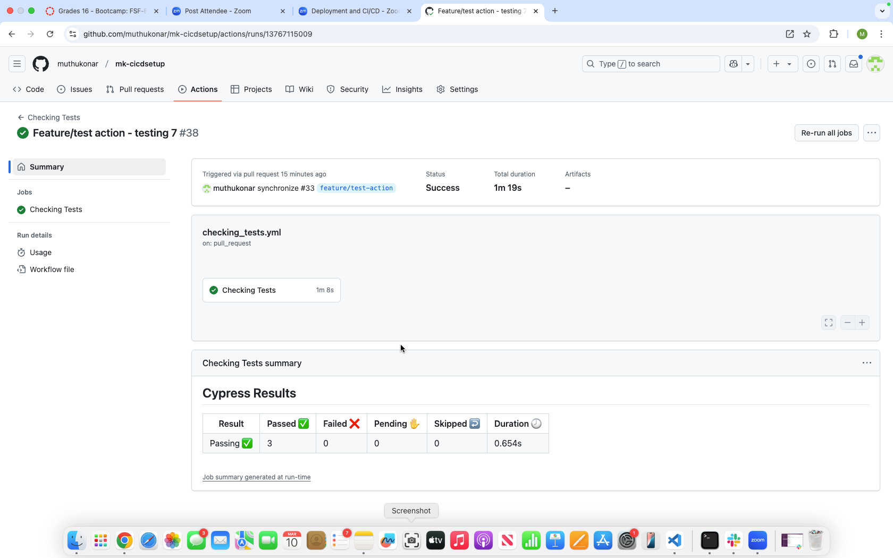
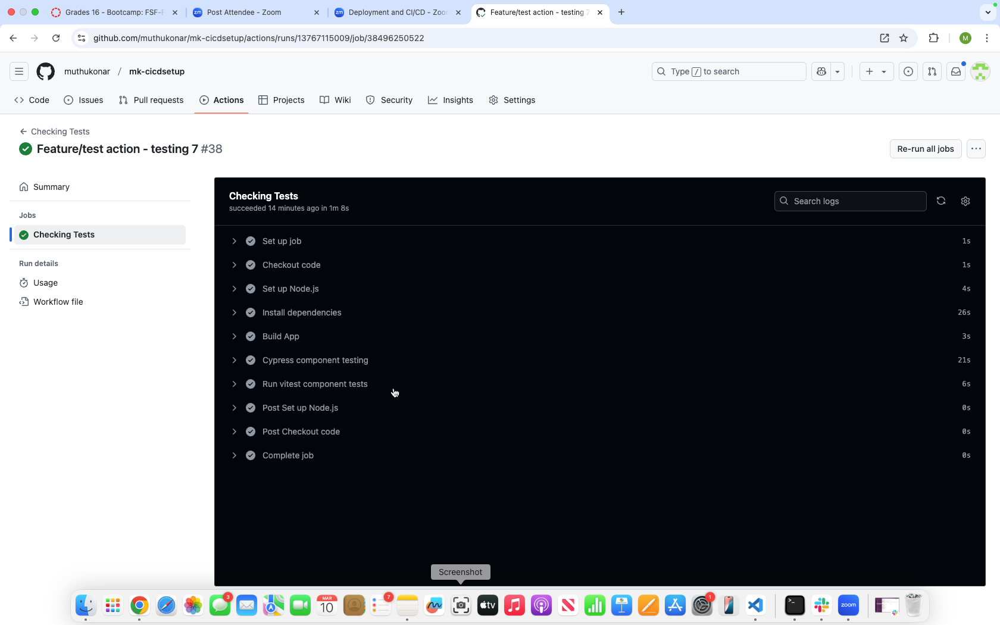
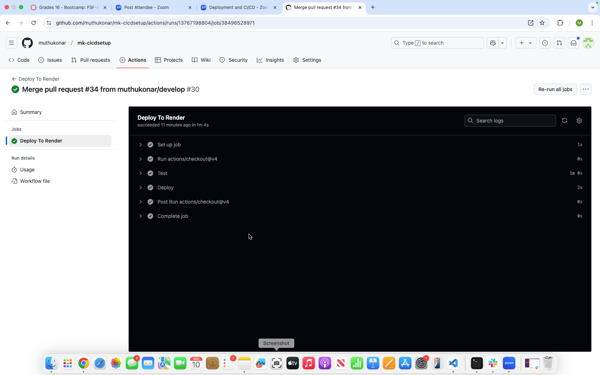

KoneTechI®  
  Mar, 2025
  
   
    
  # MK - CICD SETUP - Module 20 Challenge

  ## Description
  Create a CI/CD pipeline using GitHub Actions to run the component tests via Cypress when a Pull Request is made to the develop branch, and the application is deployed when code is merged from develop to the main branch.

  ## Table of Contents

  - [Installation](#installation)
  - [Usage](#usage)
  - [credits]()
  - [Contributing](#contributing)
  - [Tests](#tests)
  - [Screenshots](#screenshots)
  - [License](#license)
  - [Questions](#questions)

## Installation
1. Creeate a repository in GitHUB.
2. Clone to VSCode locally 
3. Unzip and upload starter Code 
4. Once all code is developed  in an integrated terminal execute following command to start the application
   - npm  i 
   - npm client build, npm server build 
   - npm run seed
   - npm run start:dev - to start the application  ( to check if application works fine)
   - npm run test-component - For command line component testing ( To check if the test component passes )
 5. Perform testing 
  - Lock the main and develop branches
  - Make changes to the code and test the actions setup (Testing and Render deploy) in github , during pull request and merge between feature branch, Develop brach and Main branch.

## Usage
Make changes to the code and test the actions setup (Testing and Render deploy) in github , during pull request and merge between feature branch, Develop brach and Main branch

## Credits
Instructor and TA's

## Contributing
Test and provide feedbacks 

 ## Tests
Test using Github pull requests and render link 

## Screenshots 
Test results screenshots below

## License
This project is licensed under the MIT license.

## Questions
For any questions, please contact me at [pmkonar@gmail.com](mailto:pmkonar@gmail.com).
You can also find more of my work at [muthukonar](https://github.com/muthukonar).

'This document was last updated on Mar, 2025'
